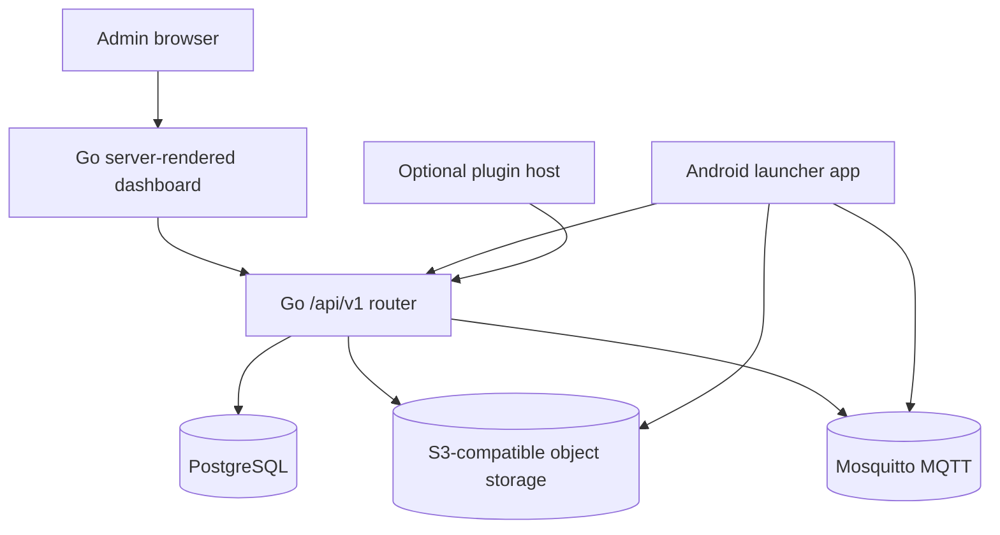

# XMDM

XMDM is a self-hosted Android device management platform for operating managed
launcher fleets with clear control, delivery, and recovery workflows.


## What It Manages

- Android launcher enrollment through QR/provisioning payloads
- Signed config sync for policy, runtime settings, apps, files, and certificates
- Kiosk behavior and package rules applied by the launcher
- Managed APK, file, and certificate delivery with checksum verification
- Device commands over MQTT with HTTP polling recovery
- Telemetry API records, device logs, device info, audit, health, backup, and release flows

For the full capability matrix, see [docs/capabilities.md](docs/capabilities.md).
For support limits, see [docs/support-boundaries.md](docs/support-boundaries.md).

## Start Here

| Goal | Start with |
| --- | --- |
| Evaluate the product shape | [Capability Matrix](docs/capabilities.md) |
| Understand runtime architecture | [System Shape](#system-shape) |
| Operate the dashboard | [Admin Dashboard](docs/admin-dashboard.md) |
| Understand command delivery | [Commands](docs/commands.md) |
| Work on the Android launcher | [Launcher Lifecycle](docs/launcher-lifecycle.md) |
| Run locally | [Local Development](infra/local-dev.md) |
| Ship a release | [Release Artifacts And Deployment](docs/release-artifacts-and-deployment.md) |

## Local Run

Start the local stack:

```sh
cd infra
docker compose -f docker-compose.yml -f docker-compose.server.yml up -d --build
```

Stop it:

```sh
cd infra
docker compose -f docker-compose.yml -f docker-compose.server.yml down
```

## System Shape

XMDM runtime architecture has four primary components: the admin dashboard,
the control-plane API, the Android launcher, and the supporting data services.



## Repository Map

- `app/`: Android launcher
- `server/`: Go server and admin dashboard
- `infra/`: local runtime and deployment assets
- `docs/`: product docs, operator guides, and runbooks
- `blueprint/`: product and architecture decisions
- `playwright/`: dashboard browser coverage

## Premium Boundary

Premium features live outside this core repository.

- Remote control for supported devices:
  [docs/admin-dashboard.md#premium-remote-control](docs/admin-dashboard.md#premium-remote-control)

## Docs

The docs hub is [docs/README.md](docs/README.md).
