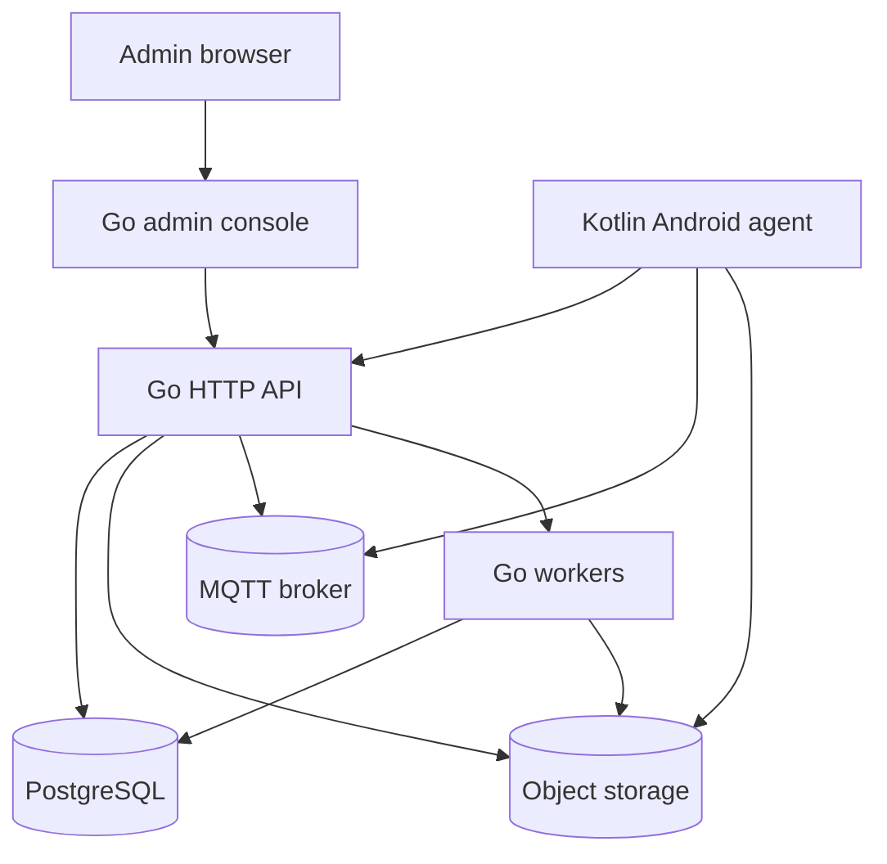

# System Architecture

## Architecture Summary

XMDM is a two-plane control system:

- a Kotlin Android agent running on each managed device
- a Go control plane that owns auth, policy, content, push, audit, and admin UI

The device only trusts the server. The server never trusts local device state without a signed response or acknowledged command path.

## Topology

## Boundary Decisions

### Why Two Languages

- Kotlin is the right tool for Android lifecycle, device-owner APIs, UI, and background work.
- Go is the right tool for a compact, deployable control plane with simple concurrency and static deployment.

### Why Not One Backend Framework Everywhere

- A shared application stack would either force Java/Android compromises into the backend or force Go to emulate Android patterns.
- XMDM needs clear ownership boundaries more than a shared language.

### Why Not Microservices First

- The product risk is in behavior and contracts, not distributed systems complexity.
- A modular monolith with explicit package boundaries is easier to ship, test, and operate.

## Server Boundaries

### Web Console

- Server-rendered HTML first.
- Minimal JavaScript for tables, forms, dialogs, and charts.
- Forms and filtered lists for devices, groups, apps, files, policies, logs, plugins, and operations.

### HTTP API

- Public enrollment and sync endpoints.
- Device telemetry and command endpoints.
- Private admin endpoints.
- Plugin endpoints.

### Worker Plane

- Push fan-out
- File processing
- App/package metadata processing
- Certificate processing
- Audit retention
- Device log retention
- Update checks
- Telemetry aggregation
- Artifact cleanup

### Storage Plane

- PostgreSQL stores all transactional records and state transitions.
- Object storage stores binaries, exports, uploaded payloads, and generated artifacts.

## Client Boundaries

### Android Agent

- Device-owner and kiosk lifecycle.
- Provisioning and enrollment.
- Sync and command execution.
- App, file, and certificate downloads.
- Background reporting and push reception.
- Local persistence for offline resilience.

## Runtime Rules

- No synchronous fan-out or artifact processing on the request thread.
- No direct DB access from the Android client.
- No shared in-memory state between workers that cannot be rebuilt from the database.
- No mandatory external queue in v1; use Go workers plus outbox-style tables.
- No command execution until a signed config snapshot has been accepted by the device.

## Android Agent Components

- Bootstrap and settings store
- Enrollment manager
- Config sync engine
- Artifact downloader
- Install manager
- Policy engine
- Kiosk engine
- Push engine
- Telemetry and log uploader
- Device admin receiver
- Background workers

## Go Control Plane Components

- Authentication service
- Enrollment service
- Device inventory service
- Configuration service
- App catalog and version service
- File service
- Certificate service
- Push service
- Audit service
- Messaging service
- Update service
- Plugin manager
- Scheduler and maintenance jobs

## End-to-End Flow

1. Admin creates policy, app, file, and group state in the console.
2. Server persists state in PostgreSQL and artifacts in object storage.
3. Device enrolls and receives a signed bootstrap snapshot.
4. Device downloads artifacts and applies policy.
5. Device reports telemetry, logs, and command acknowledgements.
6. Server pushes updates through MQTT, with HTTP polling as fallback.

## Deployment Decision

- First-class deployment is Docker Compose with server, PostgreSQL, object storage, and MQTT.
- MQTT may be embedded or external, but the runtime must support both.
- The admin console and API share the same Go binary in v1.
- Sidecar deployment models are future options, not initial requirements.

## Failure Domains

- If object storage is down, the system must still allow admin auth and metadata reads.
- If MQTT is down, polling must continue to work.
- If a worker crashes, the outbox or queue table must permit retry.
- If the agent is offline, the last valid local policy snapshot remains active until a new one is available.
