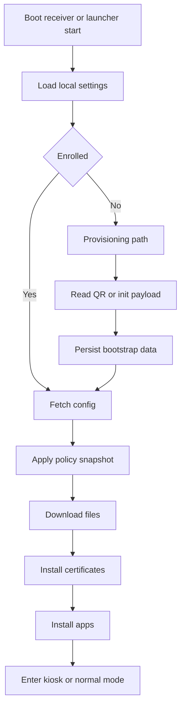

# Device Agent

## Agent Design

The Android agent is the device-side runtime that boots with the device, enrolls it, keeps its policy current, downloads content, installs apps, enforces kiosk restrictions, and reports telemetry.

The agent owns device-side state. The server owns policy truth. The device never computes policy authority on its own.

## Implementation Decisions

- Kotlin first.
- XML and ViewBinding for launcher UI.
- Coroutines and Flow for async work.
- WorkManager for retries and periodic jobs.
- Room for local persistence.
- DataStore for bootstrap and preferences.
- Retrofit and OkHttp for HTTP APIs.
- Eclipse Paho for MQTT transport.
- Foreground service for MQTT when needed.
- AndroidX for lifecycle, workers, and persistence integration.

## Agent Modules

- Provisioning and enrollment
- Bootstrap and settings
- Sync and policy application
- Artifact download and install
- Kiosk and device-owner control
- Push and command handling
- Telemetry and logs
- Recovery diagnostics

## Startup Flow

## Provisioning Flows

### QR Provisioning

- QR payload contains server URL, enrollment token, device identity policy, and optional bootstrap extras for enrollment-time values.
- The agent parses the payload and persists the bootstrap state locally.
- Enrollment binds the device to the server and returns the device secret.
- The agent fetches the signed config snapshot after enrollment and keeps refreshing it during runtime.

### Manual Or ADB Provisioning

- Manual setup exists only as a fallback for devices that cannot scan QR.
- The fallback path must still end in the same enrollment API contract as QR.
- Manual and ADB setup use the same Android provisioning JSON shape as QR, carried as a `base64url:` launch data URI.

### Required Setup Data

- `com.xmdm.BASE_URL`
- `com.xmdm.ENROLLMENT_TOKEN`
- `com.xmdm.DEVICE_ID`
- the server currently emits `com.xmdm.SECONDARY_BASE_URL` with the same value as `com.xmdm.BASE_URL`
- device runtime settings such as MQTT address and polling intervals are delivered in the signed config snapshot after enrollment

## Runtime State Machine

| State | Meaning | Exit Conditions |
| --- | --- | --- |
| `unprovisioned` | App installed but not enrolled | Enrollment success |
| `bootstrapping` | Reading bootstrap data | Sync success or fatal setup error |
| `syncing` | Pulling policy and artifacts | Sync complete |
| `applying` | Installing files, certs, apps | Install complete or failure recovery |
| `kiosk` | Restricted mode active | Admin unlock or config change |
| `normal` | Device not locked in kiosk | Policy change or command |
| `error` | Recoverable or fatal fault | Retry, reset, or operator action |

## Local Persistence

- Store device identity and server bootstrap state.
- Store the latest policy snapshot.
- Store artifact download status and checksums.
- Store pending commands and retry counters.
- Store logs and last known telemetry for offline recovery.
- Store the last successful config version and sync time.

## Download And Install Rules

- Download artifacts with resumable HTTP where possible.
- Verify checksum before installation.
- Install certificates before apps.
- Install apps before final kiosk handoff.
- Retry network failures with exponential backoff.
- Do not loop forever on permanent install errors.
- Keep download and install status separate so a failed install does not force a re-download if the artifact is already valid.

## What The Agent Downloads

- app APKs and version manifests
- managed files rendered on the server and delivered to the launcher
- certificates and trust bundles
- optional images and attachments uploaded from the server
- push-delivered payloads that reference a command or artifact

## What The Agent Sets Up

- device credentials and enrollment state
- default launcher or kiosk mode
- app allow/block state
- device restrictions and admin settings
- certificate trust state
- local caches for config and artifacts
- background sync, push, telemetry, and retry jobs

## Policy Enforcement

- Apply server policy at startup and after every config refresh.
- Enforce kiosk mode when the policy requires it.
- If policy names a kiosk app package, launch that package after boot and on kiosk re-entry.
- If policy requests kiosk keep-awake behavior, keep the kiosk activity screen on while kiosk policy is active.
- If policy requests kiosk stay-awake-while-plugged-in behavior, update the device-owner global stay-on setting while kiosk policy is active.
- If policy requests kiosk boot unlock, attempt a best-effort keyguard dismissal after reboot without password policy.
- Kiosk policies must include a kiosk exit passcode. The server hashes it into the signed snapshot, and when present the launcher accepts a hidden top-left tap sequence, prompts for the passcode locally, and suppresses kiosk until the current policy revision is replaced or the device reboots.
- Enforce app allow/block lists and package suspension.
- Enforce screen lock, restriction flags, and behavior toggles from the server.
- Never treat local UI state as authoritative over the latest policy snapshot.

## Push And Background Work

- MQTT is the primary push transport.
- HTTP polling is the fallback transport.
- The agent uses the broker address from the signed config snapshot when present and otherwise keeps polling as the safe path.
- The agent polls pending commands, executes supported ones, and acks the result back to the server.
- The `exit_kiosk` command temporarily suppresses kiosk enforcement until a newer policy revision arrives.
- WorkManager keeps telemetry, sync, and retry jobs alive across reboots.
- The agent must recover from Wi-Fi changes, device restarts, and service kills.

## Recovery Behavior

- If config fetch fails, preserve the last valid policy snapshot.
- If artifact install fails, keep the device in a recoverable state and retry later.
- If enrollment fails, record diagnostic logs rather than silently closing.
- If a command cannot execute, ack failure and keep the device usable.

## Observability

- Generate a local diagnostic trace for startup failures.
- Upload logs on a schedule and on demand.
- Preserve the last successful sync metadata locally.
- Expose enrollment and config failure details through device logs and admin inspection surfaces.
