# Admin Dashboard User Manual

This manual covers the browser dashboard from login through the main operator workflows.

The screenshots in this guide are real captures from the implemented dashboard using sample data. Regenerate them with the tooling in [docs/tools/admin-dashboard-screenshots](tools/admin-dashboard-screenshots).

## 1. Login

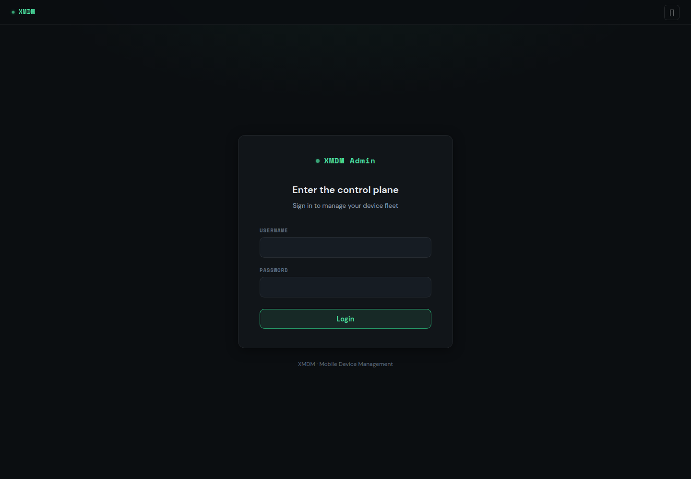

1. Start the XMDM server.
2. Open `/admin/login`.
3. Enter the admin username and password.
4. Select `Login`.
5. After login, the dashboard redirects to `/admin`.

## 2. Overview

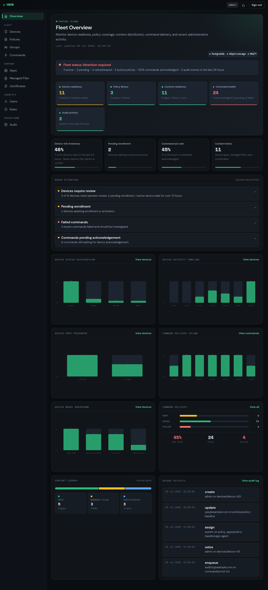

Access rules:

- All dashboard pages except `/admin/login` require a valid admin session cookie.
- Read pages require `admin.read`.
- Create, update, retire, upload, publish, revoke, and send actions require `admin.write`.
- Browser mutations require the `xmdm_csrf` cookie and matching `csrfToken` form field.
- Use `Logout` in the top bar to end the session.

The left navigation is grouped by operator task:

| Section | Path |
| --- | --- |
| Overview | `/admin` |
| Fleet | `/admin/devices`, `/admin/policies`, `/admin/groups`, `/admin/commands` |
| Content | `/admin/apps`, `/admin/managed-files`, `/admin/certificates` |
| Identity | `/admin/users`, `/admin/roles` |
| Operations | `/admin/audit` |

The overview is the fleet command center. It combines:

- a status banner with the current fleet health summary
- quick actions for devices, policies, and the audit log
- live health cards for device readiness, policy library, content readiness, command health, and audit activity
- metric cards for policy coverage, pending enrollment, command acknowledgement rate, and content items
- a needs-attention panel that surfaces active operational issues
- a 7-day audit activity chart and command breakdown
- content library and recent activity panels at the bottom of the page

Use this page to confirm the control plane has data and to jump into the resource-specific pages.

## 3. Identity

Identity covers operator accounts and permission sets.

### Users

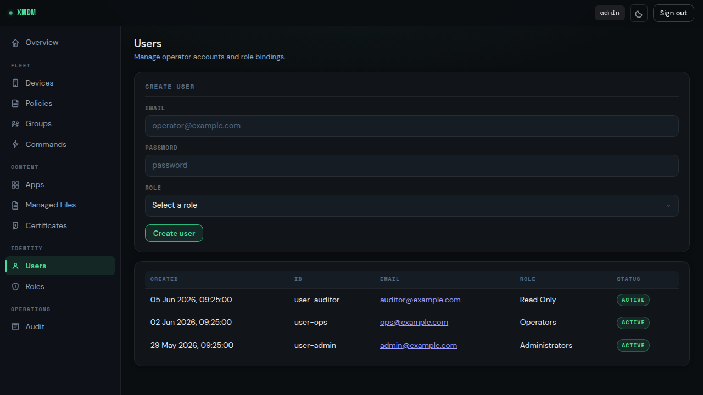

Use `/admin/users` to manage operator accounts.

The users list follows the scan-first pattern:

- `Created`
- `ID`
- `Email`
- `Role`
- `Status`

Open the user email to reach the detail page.

#### Create A User

1. Open `/admin/users`.
2. In `Create user`, enter:
   - `Email`
   - `Password`
   - `Role`
3. Select `Create user`.
4. Confirm the user appears in the table.

#### User Detail

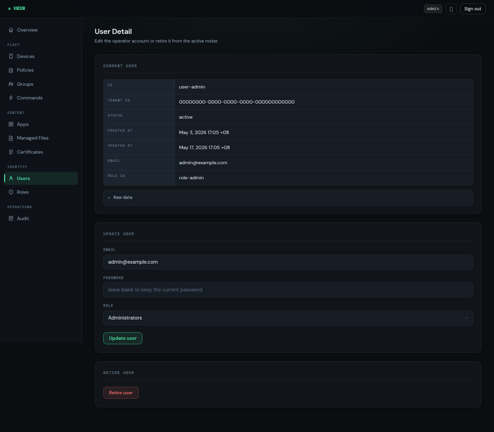

1. Open the user link in the table.
2. Review the current user record.
3. Edit the detail page fields:
   - `Email`
   - `Password` if you want to replace the current hash
   - `Role`
4. Select `Update user`.
5. Select `Retire user` from the same page when the account should no longer be active.

When `Password` is left blank during update, the backend preserves the existing stored password hash. When a new password is supplied, the backend derives and stores the replacement hash; the dashboard never displays stored password hashes.

### Roles

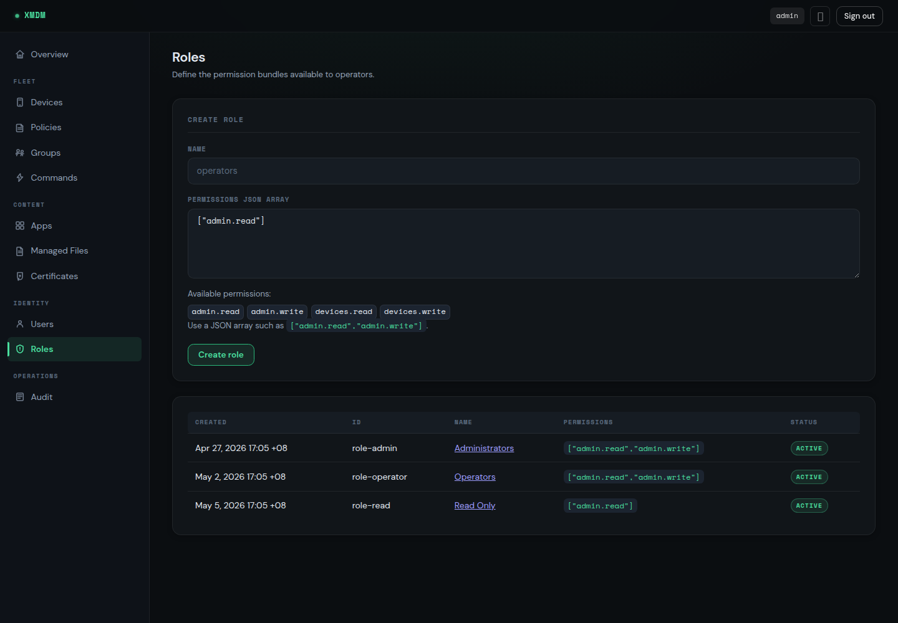

Use `/admin/roles` to manage operator permission sets.

The roles list follows the scan-first pattern:

- `Created`
- `ID`
- `Name`
- `Permissions`
- `Status`

Open the role name to reach the detail page.

#### Create A Role

1. Open `/admin/roles`.
2. In `Create role`, enter:
   - `Name`
   - `Permissions JSON array`
3. Example permissions:
   - `["admin.read"]`
   - `["admin.read","admin.write"]`
4. Select `Create role`.

#### Role Detail

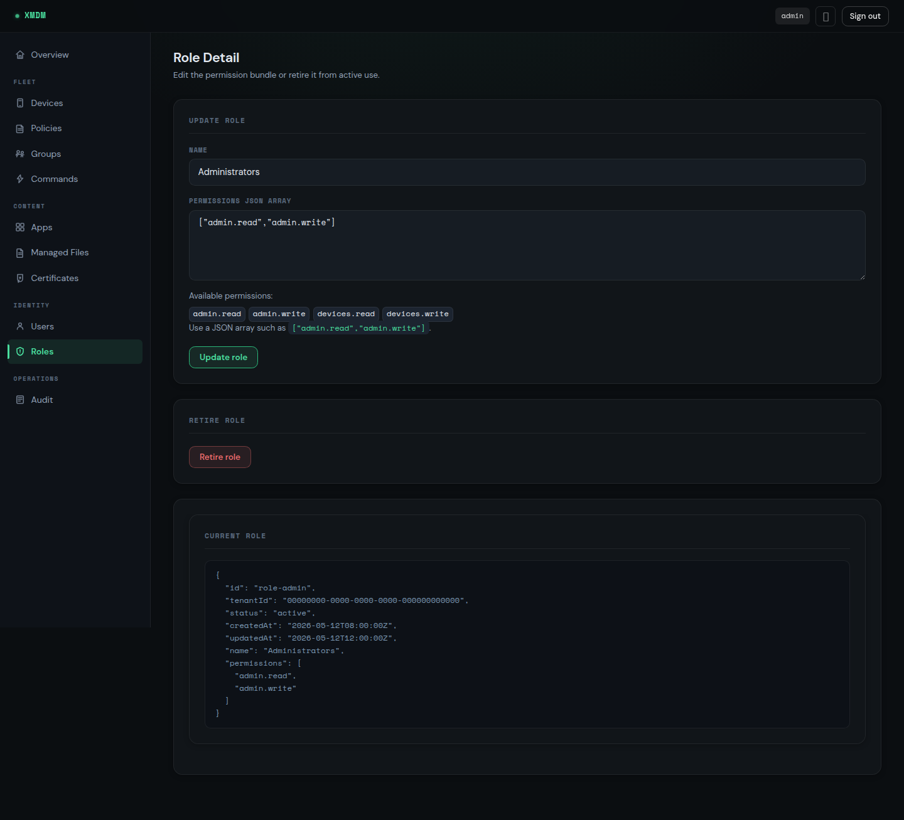

1. Open the role link in the table.
2. Review the current role record.
3. Edit the detail page fields:
   - `Name`
   - `Permissions JSON array`
4. Select `Update role`.
5. Select `Retire role` from the same page when the permission set should no longer be active.

Invalid permission JSON is rejected before the role is saved.

## 4. Device Setup

Device setup is policy-bound. The policy owns the managed apps, managed files, and managed certificates that a device receives.

### Policies

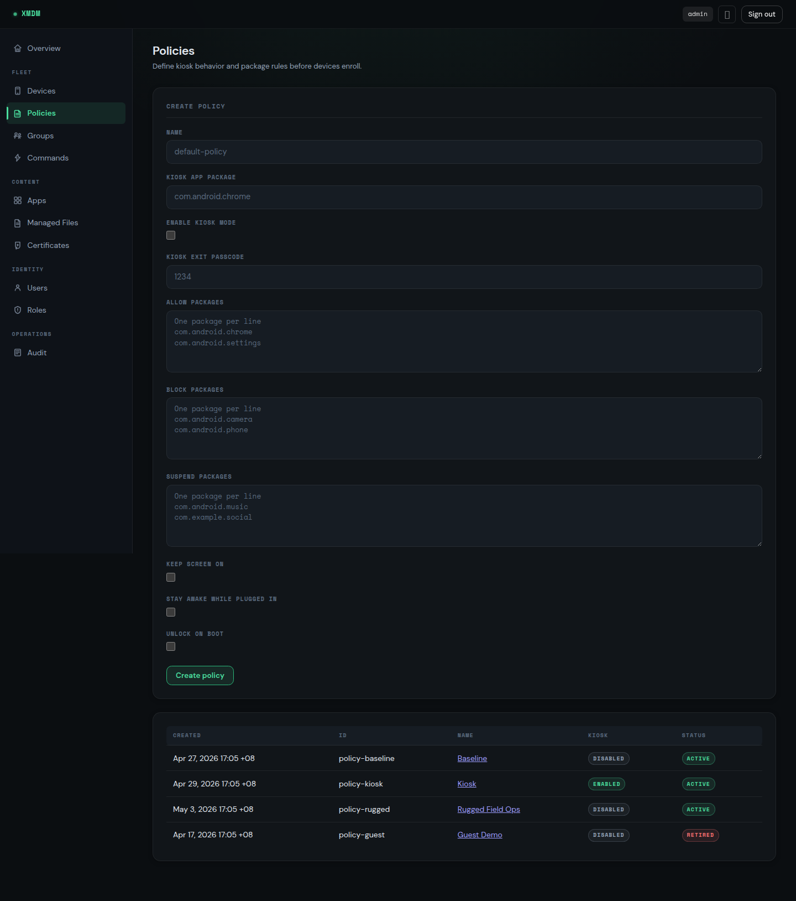

Use `/admin/policies` to define the device configuration bundle.

The policies list follows the scan-first pattern:

- `Created`
- `ID`
- `Name`
- `Kiosk`
- `Status`

Open the policy name to reach the detail page.

#### Create A Policy

1. Open `/admin/policies`.
2. In `Create policy`, enter:
   - `Name`
   - optional `Kiosk app package`
   - optional `Enable kiosk mode`
   - `Kiosk exit passcode` when kiosk is enabled
   - `Allow packages` one package per line
   - `Block packages` one package per line
   - `Suspend packages` one package per line
   - optional `Keep screen on`
   - optional `Stay awake while plugged in`
   - optional `Unlock on boot`
3. Select `Create policy`.

#### Policy Detail

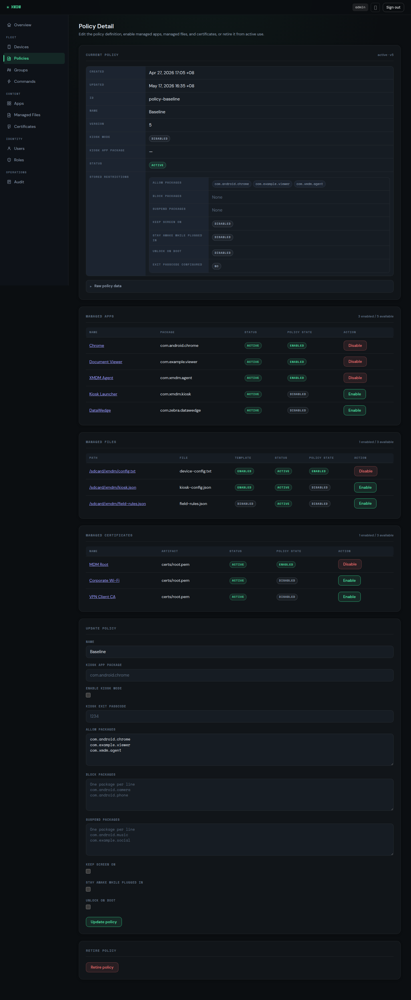

1. Open the policy name in the table.
2. Review the policy summary and current restriction inputs.
3. Toggle `Enable kiosk mode` as needed.
4. Update the generated restriction inputs.
5. Use the `Managed apps`, `Managed files`, and `Managed certificates` sections to enable or disable content for this policy.
6. Select `Update policy` when finished.
7. Select `Retire policy` from the same page when the policy should no longer be active.

Policy detail pages manage the content bindings. Devices only receive the managed apps, managed files, and certificates that are enabled on their linked policy.

### Managed Apps

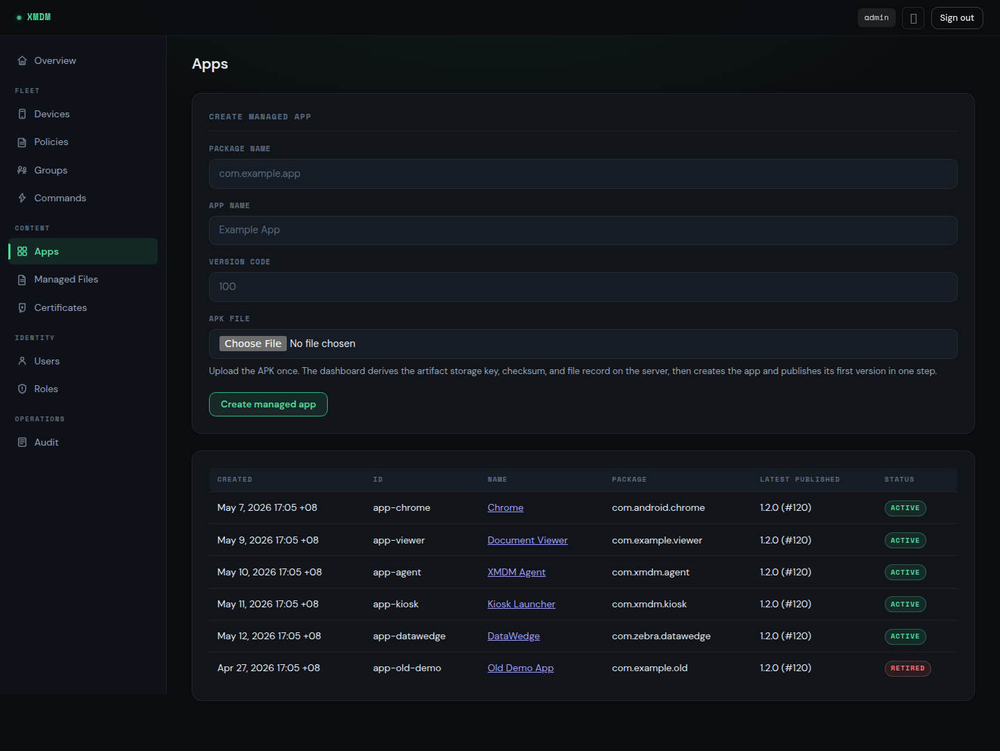

Use `/admin/apps` to create managed apps and review the app catalog in a scan-first list.

The apps list follows the scan-first pattern:

- `Created`
- `ID`
- `Name`
- `Package`
- `Latest published`
- `Status`

Open the app name to reach the detail page.

#### Create A Managed App

1. Open `/admin/apps`.
2. Enter:
   - `Package name`
   - `Name`
   - `Version code`
3. Choose the APK file to upload.
4. Select `Create managed app`.

The dashboard derives the artifact storage key, checksum, and file record from the uploaded APK on the server.
The server derives the app version name from the version code for this flow, so operators only need to supply the code.
The dashboard always publishes the new APK as another version for that app instead of creating a duplicate app row.

#### App Detail

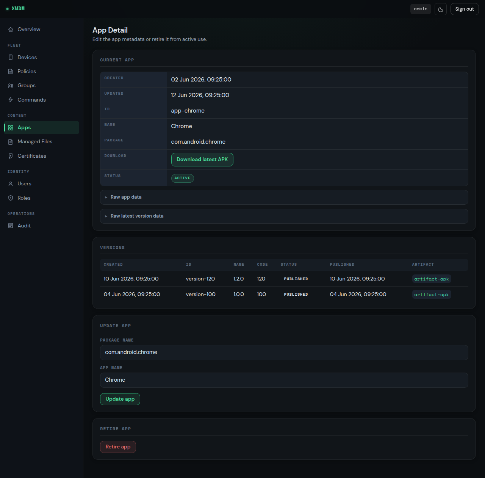

1. Open the app name in the table.
2. Review the app summary.
3. Use `Download latest APK` to retrieve the published artifact.
4. Review the published versions history.
5. Select `Update app` or `Retire app` from the detail page as needed.

### Managed Files

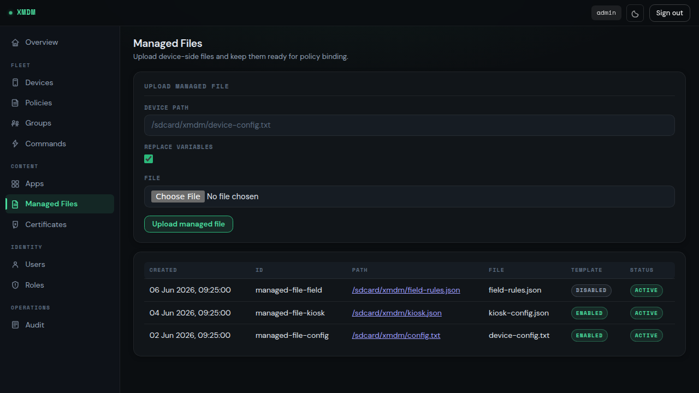

Use `/admin/managed-files` to upload a managed file and bind it to a device path in one step.
Uploading the same device path again replaces the existing binding with the new file content.

The managed-files list follows the scan-first pattern:

- `Created`
- `ID`
- `Path`
- `File`
- `Template`
- `Status`

Open the path to reach the detail page.

#### Create A Managed File

1. Open `/admin/managed-files`.
2. Enter the `Device path`.
3. Select `Replace variables` if the file should be templated.
4. Choose the file to upload.
5. Select `Upload managed file`.

#### Managed File Detail

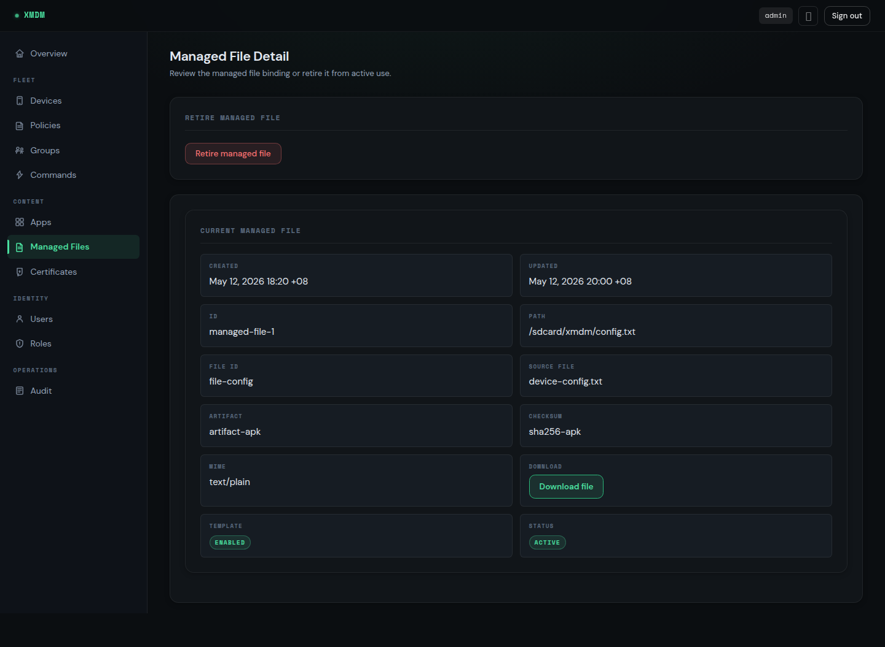

1. Open the managed-file path in the table.
2. Review the current managed-file binding.
3. Select `Download file` to fetch the uploaded content.
4. Select `Retire managed file` when the binding should no longer apply.

Managed files appear in signed device config snapshots when active.

### Certificates

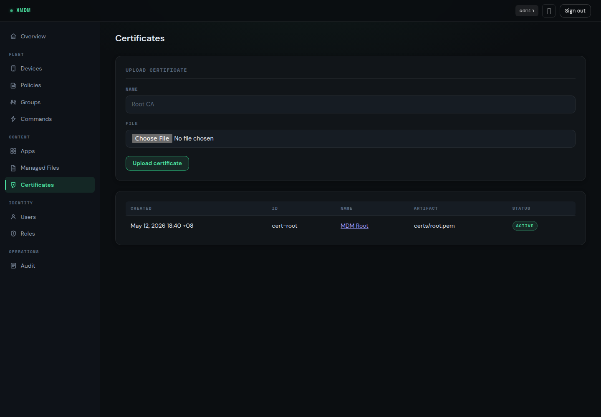

Use `/admin/certificates` to upload certificate artifacts for devices.

The certificates list follows the scan-first pattern:

- `Created`
- `ID`
- `Name`
- `Artifact`
- `Status`

Open the name to reach the detail page.

#### Upload A Certificate

1. Open `/admin/certificates`.
2. In `Upload certificate`, enter:
   - `Name`
3. Choose the certificate file.
4. Select `Upload certificate`.

The dashboard derives the storage key, checksum, size, and MIME type from the uploaded file.

#### Certificate Detail

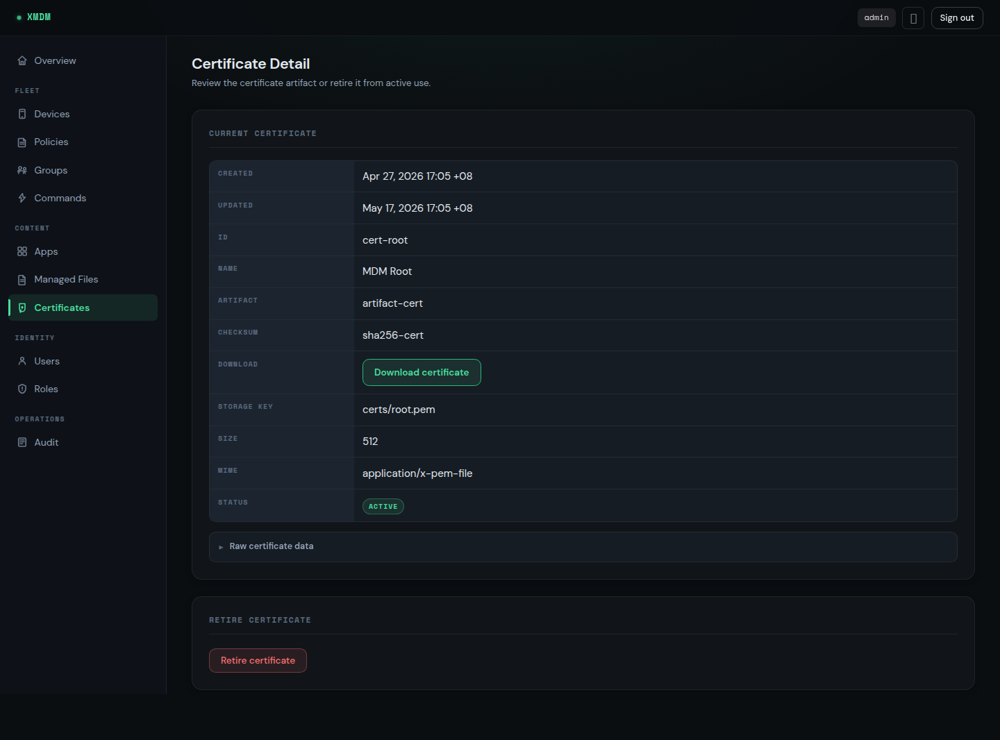

1. Open the certificate name in the table.
2. Review the current certificate record and artifact metadata.
3. Select `Download certificate` to retrieve the uploaded artifact.
4. Select `Retire certificate` when the certificate should no longer be active.

Policy detail pages also let you enable or disable certificates for a policy. Devices only receive the certificates that are enabled on their linked policy.

### Devices

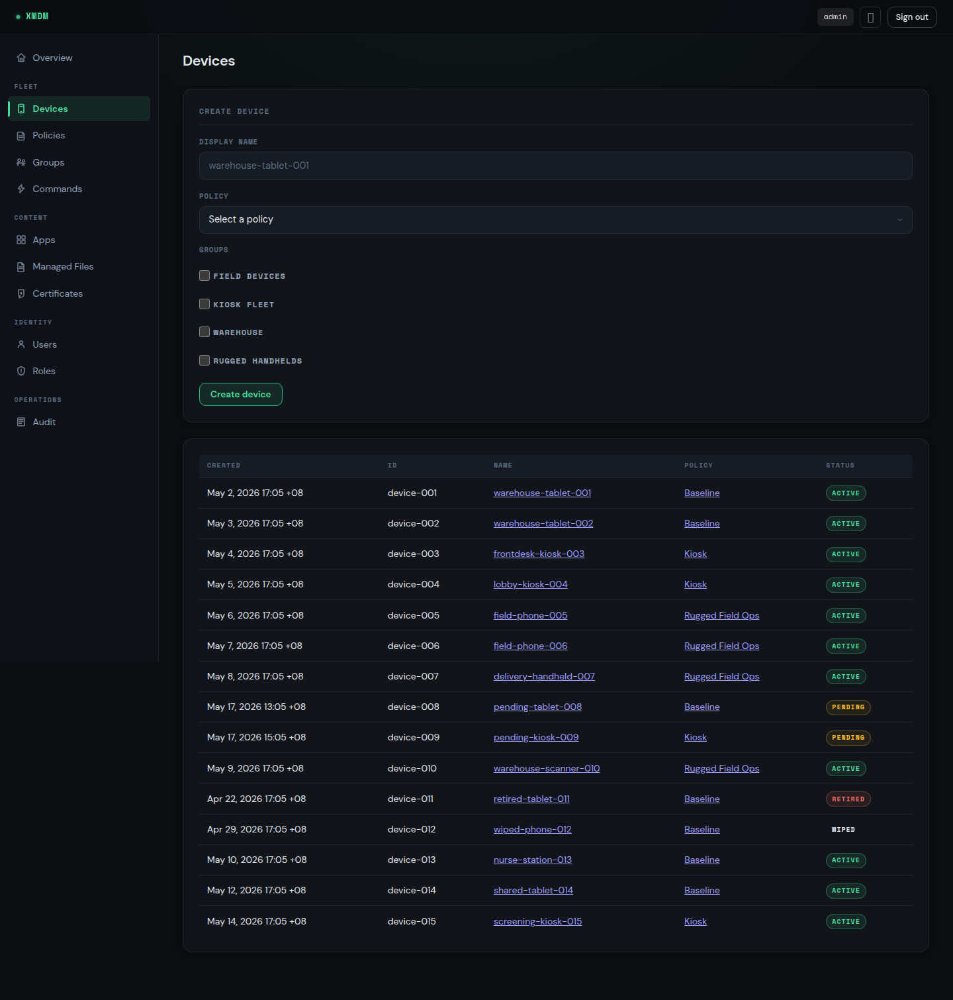

Use `/admin/devices` to create the device record that enrollment binds to.

The device list follows the scan-first pattern:

- `Created`
- `ID`
- `Name`
- `Policy`
- `Status`

Open the device name to reach the detail page.

#### Create A Device

1. Open `/admin/devices`.
2. Enter:
   - `Display name`
   - `Policy`
   - optional `Groups`
3. Select `Create device`.

The groups selector only shows active groups, uses a scrollable checkbox list, and keeps the labels compact so long group lists stay usable.

#### Device Detail

1. Open the device name in the table.
2. Review the device record and the linked active policy.
3. Review recent logs, recent device info, and pending commands from the same page.
4. Edit the device display name or linked policy as needed.
5. Select `Update device`.
6. Select `Retire device` from the same page when the device should no longer be active.

The dashboard creates the device record first, with the selected policy linked to it. New devices are created in `pending` state. The device has a server-generated immutable device ID for enrollment and runtime auth, plus a separate display name for operators. Device secret rotation is disabled for now; the dashboard does not expose the stored secret hash.
The device detail page also keeps the assigned groups editable, and the command selectors only show active or enrolled devices and active groups.

#### Generate Enrollment QR

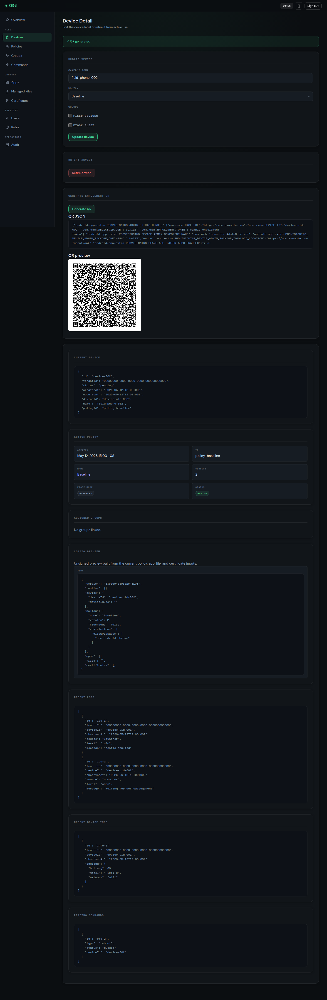

1. Open a pending device detail page.
2. Select `Generate QR`.
3. Review the QR JSON and PNG preview directly below the button.
4. Scan the QR from the target device to start enrollment.
5. Complete enrollment on the device so it can fetch its linked policy and managed content.

The QR is generated from the pending device detail page and carries the immutable device ID automatically. The device stays in the dashboard as pending until enrollment completes.

## 5. Group And Command

Groups are device cohorts for command targeting.

### Groups

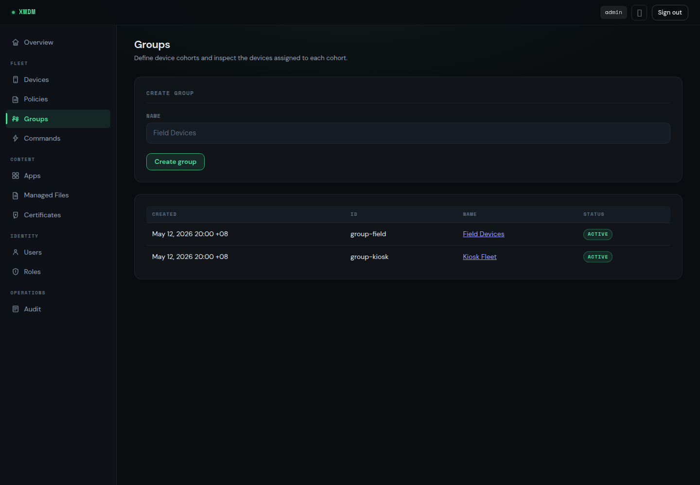

Use `/admin/groups` to organize devices.

The groups list follows the scan-first pattern:

- `Created`
- `ID`
- `Name`
- `Status`

Open the group name to reach the detail page.

#### Create A Group

1. Open `/admin/groups`.
2. Enter the group `Name`.
3. Select `Create group`.

#### Group Detail

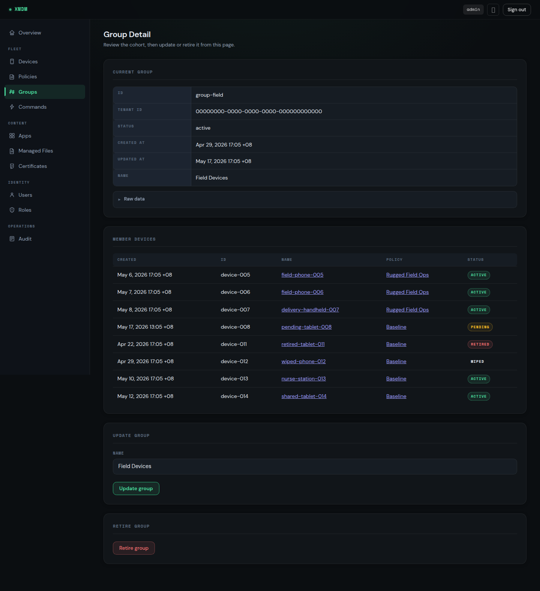

1. Open the group link in the table.
2. Review the group record and the member devices list.
3. Edit the detail page fields:
   - `Name`
4. Select `Update group`.
5. Select `Retire group` from the same page when the cohort should no longer be active.

The group detail page shows the devices that belong to the group.

### Commands

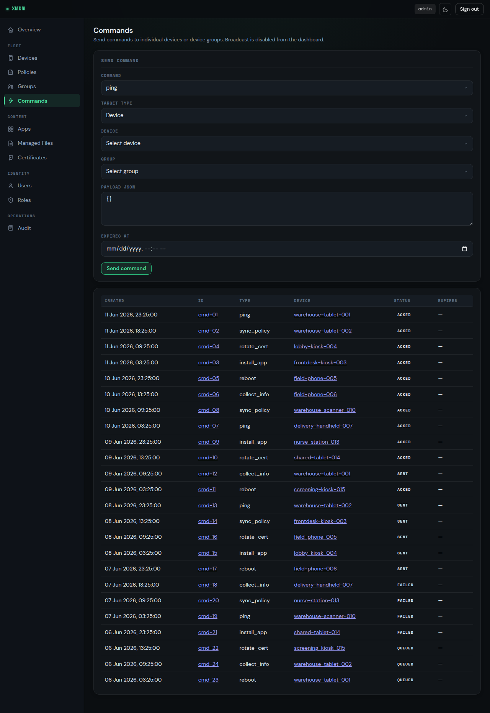
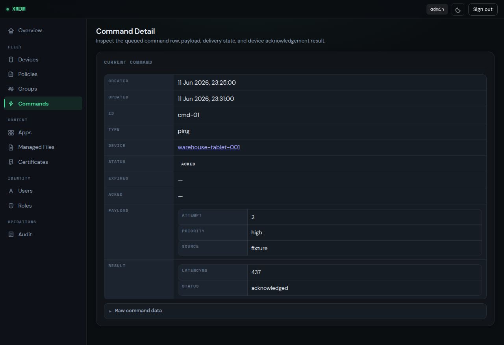

Use `/admin/commands` to send and inspect device commands.

The commands list follows the scan-first pattern:

- `Created`
- `ID`
- `Type`
- `Device`
- `Status`
- `Expires`

Open the command ID to reach the detail page.

#### Send A Command

1. Open `/admin/commands`.
2. Enter command `Type`, for example `ping`, `reboot`, `sync_config`, or `exit_kiosk`.
3. Choose `Target type`:
   - `device`
   - `group`
4. Select the target device or group from the dropdown.
5. Enter optional payload JSON.
6. Enter optional expiry.
7. Select `Send command`.

Invalid payload JSON or invalid expiry is rejected before enqueue.
Broadcast is disabled in the dashboard UI for safety, although the API still accepts it for compatibility.

#### Command Detail

1. Open the command ID in the table.
2. Review the command row, device link, payload JSON, result JSON, and ack timestamp.
3. Use the status to confirm whether the command is queued, acked, failed, or expired.

## 6. Audit

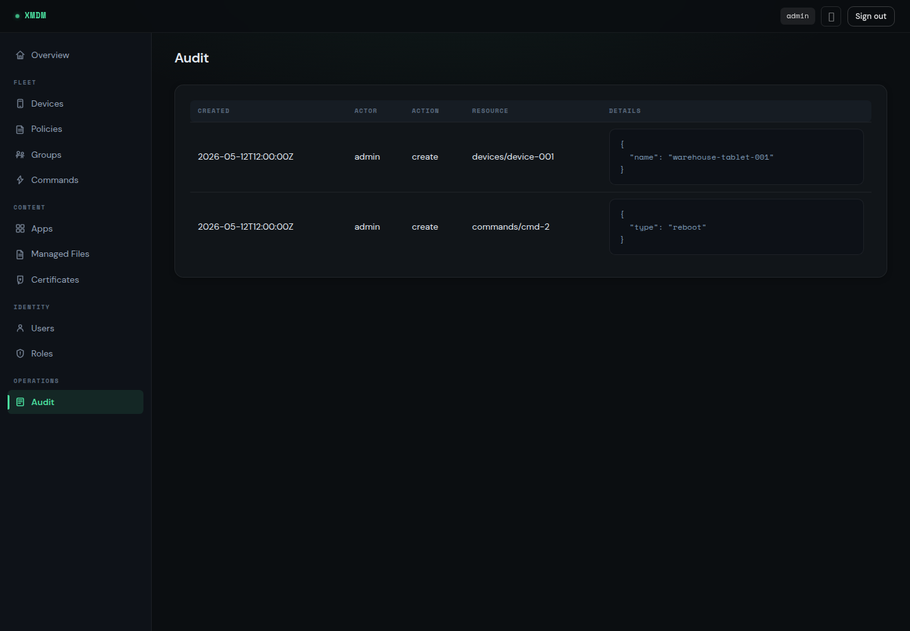

Use `/admin/audit` to inspect immutable admin activity.

Audit rows show:

- created time
- actor
- action
- resource type and ID
- details JSON

Audit events are append-only and should be used to confirm who changed what.
