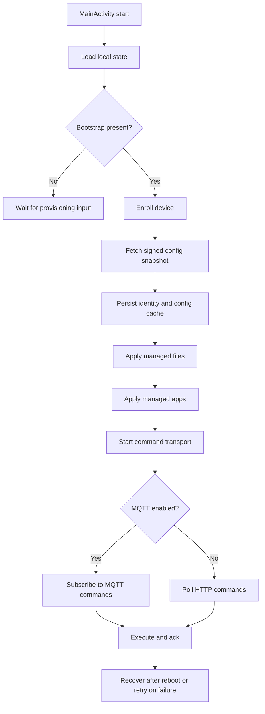

# Agent App Lifecycle

This document describes the runtime lifecycle of the Android agent in `app/`.
It is an implementation-support doc, not the source of truth for product scope.
The blueprint remains authoritative.

## Scope

The launcher has one job: turn bootstrap data into a trusted device identity, keep the signed config snapshot current, apply managed content, and keep the device available for command execution and recovery.

This lifecycle starts when `MainActivity` launches and ends only when the process is stopped, reset, or the device is retired.

## Lifecycle Phases

### 1. App Start

- `MainActivity` loads local state from `AgentStateStore`.
- The launcher renders the current bootstrap, enrollment, policy, file, and app state.
- The state collector then evaluates the next actions:
  - start enrollment if bootstrap exists and the device is not enrolled
  - fetch the signed config snapshot after enrollment
  - apply managed files from the signed snapshot
  - apply managed apps from the signed snapshot
  - start command transport when identity exists
  - start device log upload when bootstrap and identity exist

Relevant code:
- [`MainActivity`](../app/src/main/java/com/xmdm/launcher/MainActivity.kt)
- [`AgentStateStore`](../app/src/main/java/com/xmdm/launcher/state/AgentStateStore.kt)

### 2. Bootstrap Intake

- The launcher accepts bootstrap data from the provisioning intent or from manual/ADB input.
- Bootstrap parsing normalizes the payload and persists:
  - server URL
  - optional secondary server URL
  - server project
  - enrollment token
  - device identity hints
  - bootstrap extras used for enrollment-time values only

Bootstrap extras remain enrollment-time inputs. Runtime transport and sync settings now come from the signed config snapshot after enrollment.

The bootstrap payload is the handoff from device-owner provisioning into the app-owned lifecycle.

Relevant code:
- [`BootstrapPayloadParser`](../app/src/main/java/com/xmdm/launcher/bootstrap/BootstrapPayloadParser.kt)
- [`BootstrapProvisioner`](../app/src/main/java/com/xmdm/launcher/bootstrap/BootstrapProvisioner.kt)

### 3. Enrollment

- If the launcher has bootstrap data and no device identity, it calls `POST /api/v1/enrollment`.
- The server returns:
  - device ID
  - device secret
  - device status
- The launcher verifies the enrollment response, then persists:
  - device identity
- After enrollment succeeds, the launcher immediately fetches the signed config snapshot from `GET /api/v1/devices/{deviceId}/config`.
- The launcher verifies the signed snapshot, then persists:
  - config cache metadata
  - the raw signed snapshot for later replay
- If the config fetch fails, the device remains enrolled and the sync loop retries later.

The launcher treats enrollment as complete only after the server returns `status == enrolled`.
Config sync is a separate step after identity creation.

Relevant code:
- [`HttpEnrollmentGateway`](../app/src/main/java/com/xmdm/launcher/enrollment/HttpEnrollmentGateway.kt)
- [`EnrollmentCoordinator`](../app/src/main/java/com/xmdm/launcher/enrollment/EnrollmentCoordinator.kt)

### 4. Config Sync

- The launcher keeps the last signed config snapshot locally.
- The snapshot revision is the top-level `version` field in the signed payload.
- The revision changes when any mutable bucket changes:
  - `runtime`
  - `policy`
  - `apps`
  - `files`
  - `certificates`
- The `device` bucket is identity-only and does not participate in sync revisioning.
- The `runtime` bucket carries MQTT address and sync/poll intervals for the launcher.
- The launcher periodically calls `GET /api/v1/devices/{deviceId}/config` with the device secret.
- If the fetched snapshot revision matches the cached revision, the launcher does nothing.
- If the revision changes, the launcher reapplies the relevant buckets and transport timing.

The launcher verifies every fetched snapshot before it is cached or applied.

Relevant code:
- [`ConfigSyncEngine`](../app/src/main/java/com/xmdm/launcher/sync/ConfigSyncEngine.kt)
- [`ConfigSnapshotVerifier`](../app/src/main/java/com/xmdm/launcher/sync/ConfigSnapshotVerifier.kt)

### 5. Managed File Application

- Once the launcher has identity and a verified config snapshot, it applies managed files.
- For each file entry in the signed snapshot, it:
  - resolves the download URL from the server and the snapshot path
  - downloads the artifact with the device secret
  - verifies the artifact checksum
  - writes the file into the launcher sandbox
- If a file disappears from a later snapshot, the launcher deletes the previously applied file.
- If the file list is empty in a newer snapshot, the launcher treats that as an empty desired set and removes stale managed files from the previous revision.
- If `replaceVariables` is enabled, the server has already rendered the file before download, so the launcher still just writes the downloaded bytes.

Managed files are applied before managed apps so content and config can settle before package installation begins.

Relevant code:
- [`ManagedFileInstallCoordinator`](../app/src/main/java/com/xmdm/launcher/files/ManagedFileInstallCoordinator.kt)
- [`HttpManagedAppDownloader`](../app/src/main/java/com/xmdm/launcher/apps/AndroidManagedAppServices.kt)

### 6. Managed App Application

- After managed files have been processed for the current snapshot revision, the launcher applies managed apps.
- For each app entry in the signed snapshot, it:
  - resolves the artifact URL
  - downloads the APK with the device secret
  - verifies the checksum
  - installs or restores the package
- The launcher tracks installed apps by package name and version code to avoid redundant installs.
- If the config snapshot has no managed files, the launcher proceeds directly to app processing.
- If a later config revision removes an app, the launcher uninstalls the removed package on the next sync pass.

Relevant code:
- [`ManagedAppInstallCoordinator`](../app/src/main/java/com/xmdm/launcher/apps/ManagedAppInstallCoordinator.kt)
- [`HttpManagedAppDownloader`](../app/src/main/java/com/xmdm/launcher/apps/AndroidManagedAppServices.kt)
- [`AndroidManagedAppInstaller`](../app/src/main/java/com/xmdm/launcher/apps/AndroidManagedAppServices.kt)

### 7. Command Transport

- After the launcher has bootstrap data, device identity, and a verified config snapshot, it starts command transport.
- If the signed config snapshot provides an MQTT address, it subscribes over MQTT.
- Otherwise it polls:
  - `GET /api/v1/devices/{deviceId}/commands`
- Supported commands are executed locally and acknowledged back to the server:
  - `POST /api/v1/devices/{deviceId}/commands/{commandId}/ack`
- A `sync_config` command is handled like any other command, but its side effect is to call the config sync endpoint immediately:
  - `GET /api/v1/devices/{deviceId}/config`
- The command ack is sent only after the config refresh succeeds.

Relevant code:
- [`HttpDeviceCommandGateway`](../app/src/main/java/com/xmdm/launcher/commands/HttpDeviceCommandGateway.kt)
- [`MqttDeviceCommandTransport`](../app/src/main/java/com/xmdm/launcher/commands/MqttDeviceCommandTransport.kt)
- [`DeviceCommandCoordinator`](../app/src/main/java/com/xmdm/launcher/commands/DeviceCommandCoordinator.kt)

### 8. Device Log Upload

- Once the launcher has bootstrap data and device identity, it starts a periodic log upload loop.
- The launcher records structured lifecycle events during:
  - startup
  - bootstrap intake
  - enrollment
  - config sync
  - managed file application
  - managed app application
  - command transport
- It batches those entries and uploads them to:
  - `POST /api/v1/devices/{deviceId}/logs`
- If the first upload happens before any buffered entries exist, the launcher retries later through the periodic loop.
- Log uploads are separate from config sync so a log burst cannot block the signed snapshot refresh path.

Relevant code:
- [`DeviceLogCoordinator`](../app/src/main/java/com/xmdm/launcher/logs/DeviceLogCoordinator.kt)
- [`DeviceLogStore`](../app/src/main/java/com/xmdm/launcher/logs/DeviceLogStore.kt)
- [`HttpDeviceLogGateway`](../app/src/main/java/com/xmdm/launcher/logs/HttpDeviceLogGateway.kt)

### 9. Device Log Categories

The device currently emits structured logs for these launcher events:

- `launcher`
  - app process start and high-level lifecycle markers
- `bootstrap`
  - bootstrap intent received
  - bootstrap parsing success or failure
- `enrollment`
  - enrollment attempt started
  - enrollment succeeded or failed
- `sync`
  - initial config sync succeeded or failed
  - periodic config sync refreshed or failed
- `files`
  - managed files applied or failed
- `apps`
  - managed apps applied or failed
- `commands`
  - MQTT command transport connect, failure, and polling fallback
  - command polling activity
  - command-triggered config sync

Each log entry carries a human-readable `message` plus a structured `payload` with context such as:

- `bootstrapHash`
- `deviceId`
- `configRevision`
- `syncedAtEpochMillis`
- `mqttAddress`
- `count`
- `version`
- `installed`
- `uninstalled`
- `error`

## API Calls

These are the HTTP paths the launcher calls during the lifecycle.

### Provisioning

- `POST /api/v1/enrollment`
  - Sent once bootstrap is present and enrollment has not completed.
  - Returns the device ID, device secret, and enrollment status.

### Config Sync

- `GET /api/v1/devices/{deviceId}/config`
  - Sent after enrollment and on a periodic sync loop.
  - Returns the signed config snapshot containing runtime settings, policy, apps, files, and certificates.

### Managed File Download

- `GET /api/v1/devices/{deviceId}/managed-files/{managedFileId}/artifact`
  - Used to download each managed file artifact with the device secret header.
  - The actual path is resolved from the signed snapshot entry.

### Managed App Download

- `GET /api/v1/devices/{deviceId}/apps/{appId}/versions/{versionId}/artifact`
  - Used to download each managed app artifact with the device secret header.
  - The actual path is resolved from the signed snapshot entry.

### Command Polling And Ack

- `GET /api/v1/devices/{deviceId}/commands`
  - Used when the signed config snapshot does not provide an MQTT address.
- `POST /api/v1/devices/{deviceId}/commands/{commandId}/ack`
  - Used to report execution results for supported commands.

### Command-Triggered Config Sync

- `sync_config` command
  - Delivered through MQTT when available, otherwise through HTTP polling.
  - Triggers the launcher to fetch `GET /api/v1/devices/{deviceId}/config` immediately.
  - Useful for push-driven refresh when admin updates policy, apps, files, or certificates.

### Device Log Upload

- `POST /api/v1/devices/{deviceId}/logs`
  - Used for structured launcher lifecycle logs.
  - Uses the device secret in `X-XMDM-Device-Secret`.

### Not Called By The Device During Provisioning

- `POST /api/v1/enrollment/tokens`
- `POST /api/v1/enrollment/qr/json`
- `POST /api/v1/enrollment/qr`

Those are admin or server-side setup paths, not device runtime calls.

### 8. Recovery And Reboot

- If enrollment fails, the launcher surfaces recovery UI instead of silently exiting.
- If config sync or content application fails, the launcher keeps the last known good state and retries on the next viable pass.
- Local state survives reboot through DataStore.
- On restart, the launcher replays the stored bootstrap, identity, and config cache to resume the lifecycle without re-enrollment.

Relevant code:
- [`MainActivity`](../app/src/main/java/com/xmdm/launcher/MainActivity.kt)
- [`LauncherEnrollmentStateMachine`](../app/src/main/java/com/xmdm/launcher/state/LauncherEnrollmentStateMachine.kt)

## State Model

The launcher state is effectively a pipeline:

| State | Meaning | Next Step |
| --- | --- | --- |
| `bootstrap empty` | No bootstrap payload stored | Wait for provisioning input |
| `bootstrap restored` | Bootstrap payload is present | Attempt enrollment |
| `enrollment: in progress` | Enrollment request is running | Wait for server response |
| `enrollment: success` | Device identity is stored | Apply policy and content |
| `config cache: restored` | Signed config is stored | Apply files and apps |
| `managed files: restored` | Managed files match the current config revision | Apply managed apps |
| `managed apps: restored` | App state matches the current config revision | Start or continue command transport |

The UI exposes these states to make device-side recovery visible during provisioning and support.

## Provisioning Order

The expected first-run order is:

1. Bootstrap is persisted.
2. Enrollment binds the device and returns a secret.
3. The signed config snapshot is fetched and stored.
4. Managed files are downloaded and written, or stale files are deleted if the new snapshot is empty.
5. Managed apps are downloaded and installed.
6. Command transport starts.
7. Device log upload starts and continues independently of config sync.

If any later step fails, the earlier successful state remains on disk and the launcher can retry without repeating bootstrap intake.

## Why This Lifecycle Exists

- Enrollment must happen before any device-authenticated artifact download.
- Config must be verified before content application.
- Managed files must precede managed apps so the launcher can stabilize content state first.
- Managed apps can proceed immediately when the config snapshot has no managed files.
- Command transport must wait for device identity so requests can be authenticated.
- Device logs can be buffered before identity exists, but upload waits until the launcher has identity and server URL context.
- A command can request an immediate config refresh without changing the sync contract.
- Persistent local state is required so reboot does not force manual reprovisioning.

## Config Buckets

The signed config snapshot contains multiple buckets:

- `device`
  - identity metadata only
  - used for replay and request correlation
  - does not drive sync revision changes
- `policy`
  - kiosk mode and package restrictions
  - this is the main post-provision admin-updatable behavior bucket today
- `apps`
  - managed app inventory and version metadata
  - used by the launcher to download, install, and uninstall packages
- `files`
  - managed file inventory and rendered checksums
  - used by the launcher to write and remove sandbox files
- `certificates`
  - signed and transported with the snapshot
  - currently carried in the config envelope, but not yet applied by launcher code

The launcher applies only the buckets it knows how to enforce today. Unknown or future fields remain part of the signed envelope so the contract can evolve without breaking verification.

### Bucket Behavior

| Bucket | Add / Update | Remove | Notes |
| --- | --- | --- | --- |
| `policy` | Replace the cached signed snapshot and reapply policy controllers | Implicitly removed when the snapshot no longer carries the old policy state | Controls kiosk mode and package restrictions |
| `apps` | Install or upgrade if the package is missing or the installed `versionCode` differs | Uninstall packages that were present in the previous snapshot but are absent from the new one | Uses package name and version code to detect changes |
| `files` | Download and overwrite each declared file path | Delete files that were present in the previous snapshot but are absent from the new one, or marked `remove=true` | Empty file lists are treated as a real sync state and delete stale files |
| `certificates` | Not yet applied by the launcher | Not yet applied by the launcher | Present in the signed envelope, but no device-side enforcement exists yet |
| `device` | Not applicable | Not applicable | Identity-only; does not participate in config revision changes |

Revision changes are coarse-grained: when the snapshot revision changes, the launcher re-evaluates all supported buckets, then each coordinator decides whether it needs to add, update, or remove anything inside its own bucket.
