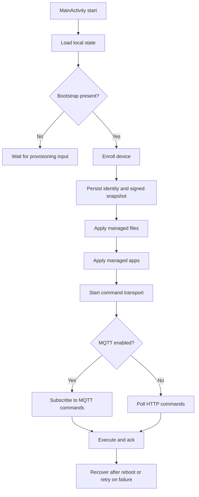

# Agent App Lifecycle

This document describes the runtime lifecycle of the Android agent in `app/`.
It is an implementation-support doc, not the source of truth for product scope.
The blueprint remains authoritative.

## Scope

The launcher has one job: turn bootstrap data into a trusted device identity, keep the policy snapshot current, apply managed content, and keep the device available for command execution and recovery.

This lifecycle starts when `MainActivity` launches and ends only when the process is stopped, reset, or the device is retired.

## Lifecycle Phases

### 1. App Start

- `MainActivity` loads local state from `AgentStateStore`.
- The launcher renders the current bootstrap, enrollment, policy, file, and app state.
- The state collector then evaluates the next actions:
  - start enrollment if bootstrap exists and the device is not enrolled
  - apply managed files if policy cache and identity are present
  - apply managed apps once managed files have been applied
  - start command transport when identity exists

Relevant code:
- [`MainActivity`](../app/src/main/java/com/xmdm/launcher/MainActivity.kt)
- [`AgentStateStore`](../app/src/main/java/com/xmdm/launcher/state/AgentStateStore.kt)

### 2. Bootstrap Intake

- The launcher accepts bootstrap data from the provisioning intent or from manual/ADB input.
- Bootstrap parsing normalizes the payload and persists:
  - server URL
  - optional secondary server URL
  - server project
  - enrollment token
  - device identity hints
  - bootstrap extras

The bootstrap payload is the handoff from device-owner provisioning into the app-owned lifecycle.

Relevant code:
- [`BootstrapPayloadParser`](../app/src/main/java/com/xmdm/launcher/bootstrap/BootstrapPayloadParser.kt)
- [`BootstrapProvisioner`](../app/src/main/java/com/xmdm/launcher/bootstrap/BootstrapProvisioner.kt)

### 3. Enrollment

- If the launcher has bootstrap data and no device identity, it calls `POST /api/v1/enrollment`.
- The server returns:
  - device ID
  - device secret
  - device status
  - initial signed config snapshot
- The launcher verifies the signed snapshot, then persists:
  - device identity
  - policy cache metadata

The launcher treats enrollment as complete only after the server returns `status == enrolled` and the snapshot signature verifies.
That snapshot is the first policy snapshot the rest of the lifecycle uses.

Relevant code:
- [`HttpEnrollmentGateway`](../app/src/main/java/com/xmdm/launcher/enrollment/HttpEnrollmentGateway.kt)
- [`EnrollmentCoordinator`](../app/src/main/java/com/xmdm/launcher/enrollment/EnrollmentCoordinator.kt)

### 4. Policy Snapshot

- The launcher keeps the last signed policy snapshot locally.
- In the current runtime flow, the initial signed snapshot comes from enrollment.
- The app also contains a reusable sync engine contract for verified snapshot fetches and retries, but that engine is not the current provisioning handoff path.
- Any snapshot used by the launcher must verify against the device secret before it is persisted or applied.

At this stage the launcher is still only holding policy truth. It has not yet applied content.

Relevant code:
- [`ConfigSyncEngine`](../app/src/main/java/com/xmdm/launcher/sync/ConfigSyncEngine.kt)
- [`ConfigSnapshotVerifier`](../app/src/main/java/com/xmdm/launcher/sync/ConfigSnapshotVerifier.kt)

### 5. Managed File Application

- Once policy cache and identity exist, the launcher applies managed files.
- For each file entry in the signed snapshot, it:
  - resolves the download URL from the server and the snapshot path
  - downloads the artifact with the device secret
  - verifies the artifact checksum
  - writes the file into the launcher sandbox
- If `replaceVariables` is enabled, bootstrap values are substituted before the file is written.

Managed files are applied before managed apps so content and config can settle before package installation begins.

Relevant code:
- [`ManagedFileInstallCoordinator`](../app/src/main/java/com/xmdm/launcher/files/ManagedFileInstallCoordinator.kt)
- [`HttpManagedAppDownloader`](../app/src/main/java/com/xmdm/launcher/apps/AndroidManagedAppServices.kt)

### 6. Managed App Application

- After managed files are present for the current snapshot version, the launcher applies managed apps.
- For each app entry in the signed snapshot, it:
  - resolves the artifact URL
  - downloads the APK with the device secret
  - verifies the checksum
  - installs or restores the package
- The launcher tracks installed apps by package name and version code to avoid redundant installs.

Relevant code:
- [`ManagedAppInstallCoordinator`](../app/src/main/java/com/xmdm/launcher/apps/ManagedAppInstallCoordinator.kt)
- [`HttpManagedAppDownloader`](../app/src/main/java/com/xmdm/launcher/apps/AndroidManagedAppServices.kt)
- [`AndroidManagedAppInstaller`](../app/src/main/java/com/xmdm/launcher/apps/AndroidManagedAppServices.kt)

### 7. Command Transport

- After the launcher has bootstrap data and device identity, it starts command transport.
- If bootstrap extras provide an MQTT address, it subscribes over MQTT.
- Otherwise it polls:
  - `GET /api/v1/devices/{deviceId}/commands`
- Supported commands are executed locally and acknowledged back to the server:
  - `POST /api/v1/devices/{deviceId}/commands/{commandId}/ack`

Relevant code:
- [`HttpDeviceCommandGateway`](../app/src/main/java/com/xmdm/launcher/commands/HttpDeviceCommandGateway.kt)
- [`MqttDeviceCommandTransport`](../app/src/main/java/com/xmdm/launcher/commands/MqttDeviceCommandTransport.kt)
- [`DeviceCommandCoordinator`](../app/src/main/java/com/xmdm/launcher/commands/DeviceCommandCoordinator.kt)

## API Calls

These are the HTTP paths the launcher calls during the lifecycle.

### Provisioning

- `POST /api/v1/enrollment`
  - Sent once bootstrap is present and enrollment has not completed.
  - Returns the device secret plus the initial signed policy snapshot.

### Managed File Download

- `GET /api/v1/devices/{deviceId}/managed-files/{managedFileId}/artifact`
  - Used to download each managed file artifact with the device secret header.
  - The actual path is resolved from the signed snapshot entry.

### Managed App Download

- `GET /api/v1/devices/{deviceId}/apps/{appId}/versions/{versionId}/artifact`
  - Used to download each managed app artifact with the device secret header.
  - The actual path is resolved from the signed snapshot entry.

### Command Polling And Ack

- `GET /api/v1/devices/{deviceId}/commands`
  - Used when MQTT is not configured in bootstrap extras.
- `POST /api/v1/devices/{deviceId}/commands/{commandId}/ack`
  - Used to report execution results for supported commands.

### Not Called By The Device During Provisioning

- `POST /api/v1/enrollment/tokens`
- `POST /api/v1/enrollment/qr/json`
- `POST /api/v1/enrollment/qr`

Those are admin or server-side setup paths, not device runtime calls.

### 8. Recovery And Reboot

- If enrollment fails, the launcher surfaces recovery UI instead of silently exiting.
- If content application fails, the launcher keeps the last known good state and retries on the next viable pass.
- Local state survives reboot through DataStore.
- On restart, the launcher replays the stored bootstrap, identity, and policy cache to resume the lifecycle without re-enrollment.

Relevant code:
- [`MainActivity`](../app/src/main/java/com/xmdm/launcher/MainActivity.kt)
- [`LauncherEnrollmentStateMachine`](../app/src/main/java/com/xmdm/launcher/state/LauncherEnrollmentStateMachine.kt)

## State Model

The launcher state is effectively a pipeline:

| State | Meaning | Next Step |
| --- | --- | --- |
| `bootstrap empty` | No bootstrap payload stored | Wait for provisioning input |
| `bootstrap restored` | Bootstrap payload is present | Attempt enrollment |
| `enrollment: in progress` | Enrollment request is running | Wait for server response |
| `enrollment: success` | Device identity is stored | Apply policy and content |
| `policy cache: restored` | Signed config is stored | Apply files and apps |
| `managed files: restored` | Managed files match the policy version | Apply managed apps |
| `managed apps: restored` | App state matches the policy version | Start or continue command transport |

The UI exposes these states to make device-side recovery visible during provisioning and support.

## Provisioning Order

The expected first-run order is:

1. Bootstrap is persisted.
2. Enrollment binds the device and returns a secret.
3. The signed policy snapshot is stored.
4. Managed files are downloaded and written.
5. Managed apps are downloaded and installed.
6. Command transport starts.

If any later step fails, the earlier successful state remains on disk and the launcher can retry without repeating bootstrap intake.

## Why This Lifecycle Exists

- Enrollment must happen before any device-authenticated artifact download.
- Policy must be verified before content application.
- Managed files must precede managed apps so the launcher can stabilize content state first.
- Command transport must wait for device identity so requests can be authenticated.
- Persistent local state is required so reboot does not force manual reprovisioning.
