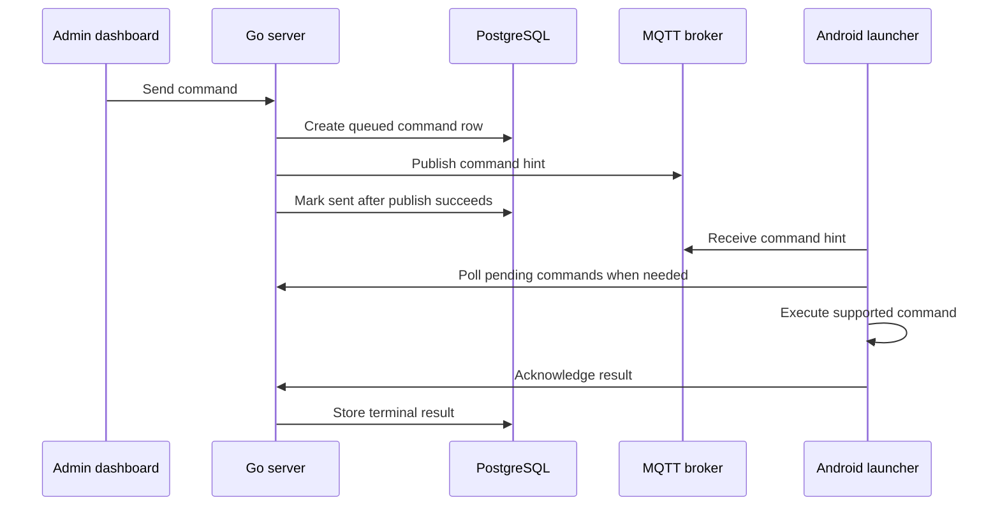

# Commands

Commands let an operator request a supported action on enrolled Android
launchers from the admin dashboard.

## Operator Workflow

Use `/admin/commands` to send and inspect commands.

The dashboard command form accepts:

- command type
- target type: `device` or `group`
- target device or group
- optional payload JSON
- optional expiry time

The command list shows created time, ID, type, device, status, and expiry. The
command detail page shows the command row, target device, payload JSON, result
JSON, acknowledgement time, and transport details reported by the launcher.

## Built-In Command Types

| Command | Launcher behavior |
| --- | --- |
| `ping` | Acknowledges with `pong`. |
| `reboot` | Requests a device-owner reboot through Android device policy APIs. |
| `sync_config` | Fetches the signed config snapshot immediately and acknowledges after the refresh succeeds. |
| `exit_kiosk` | Runs the launcher kiosk-exit path. |
| `launch_companion_app` | Launches a declared companion package or activity from the command payload. |

Plugins can register additional command types through the plugin command
catalog. Plugin command types still use the core command queue, delivery, expiry,
and acknowledgement behavior.

## Targeting

Device targeting creates one command row for the selected device.

Group targeting resolves the active group membership and creates one command row
per target device.

Command targeting resolves devices that remain eligible for runtime command
delivery.

## Delivery Lifecycle

Commands are persisted before delivery is attempted.



## Statuses

| Status | Meaning |
| --- | --- |
| `queued` | The command is stored and available for device polling. |
| `sent` | MQTT publish succeeded; the command remains available for polling until it is acknowledged or expires. |
| `acked` | The launcher completed the command and acknowledged success. |
| `failed` | The launcher acknowledged a failed execution result. |
| `expired` | The command passed its expiry while still queued or sent. |

## MQTT And Polling

MQTT is the push path. The server publishes command hints to
`devices/{deviceId}/commands`.

HTTP polling is the recovery path. The launcher polls:

```text
GET /api/v1/devices/{deviceId}/commands
```

The polling response contains active `queued` and `sent` commands for the
authenticated device. Expiry turns older queued or sent rows into terminal
records.

## Acknowledgements

The launcher acknowledges command results with:

```text
POST /api/v1/devices/{deviceId}/commands/{commandId}/ack
```

Accepted acknowledgement statuses are:

- `acked`
- `failed`

Acknowledgements are accepted only from the device that owns the command.
Repeated acknowledgement of an already terminal command returns the stored
terminal command row.

The launcher includes transport context in acknowledgement details, including
whether the command came through MQTT or polling.

## Duplicate Delivery

MQTT and polling can surface the same command ID. The command ID is the
idempotency key across both transports.

The launcher keeps command execution results by command ID. Duplicate delivery
reuses the stored terminal result instead of re-running the command action.

## Observability

Use these surfaces to inspect command behavior:

- `/admin` overview for command health and acknowledgement rate
- `/admin/commands` for command list and status filtering by inspection
- command detail page for payload, result JSON, ack time, and transport source
- `/metrics` for HTTP request volume and latency around command creation,
  polling, and acknowledgement
- launcher logs for command received, executed, acknowledgement sent, and
  command-triggered config sync events

## Cleanup

The cleanup pass expires queued or sent commands that have passed their expiry
time. See [Cleanup Pass](cleanup-pass.md).
