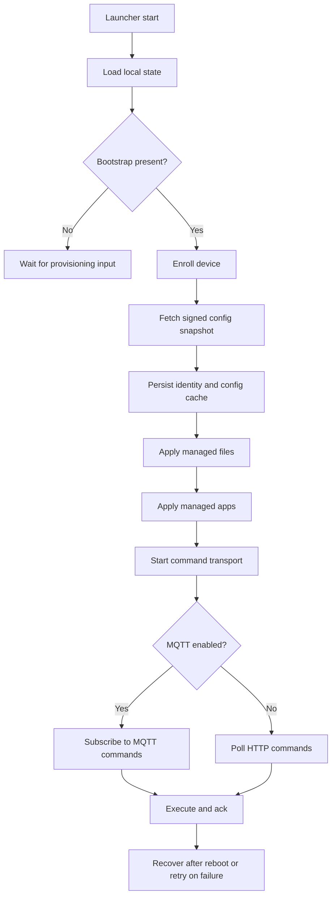

# Launcher Lifecycle

The Android launcher runtime turns provisioning input into an enrolled device,
keeps signed config current, applies managed content, and runs command
transport.

## Scope

The launcher has one job: turn bootstrap data into a trusted device identity, keep the signed config snapshot current, apply managed content, and keep the device available for command execution and recovery.

This lifecycle starts when the launcher starts and ends only when the process is
stopped, reset, or the device is retired.

## Lifecycle Phases

### 1. App Start

- The launcher loads local state.
- The launcher renders the current bootstrap, enrollment, policy, file, and app state.
- The state collector then evaluates the next actions:
  - start enrollment if bootstrap exists and the device is not enrolled
  - fetch the signed config snapshot after enrollment
  - apply managed files from the signed snapshot
  - apply managed apps from the signed snapshot
  - relaunch the launcher after boot so kiosk policy can be enforced
  - start command transport when identity exists
  - start device log upload when bootstrap and identity exist
  - upload device info after enrollment and after config/app/file changes

### 2. Bootstrap Intake

- The launcher accepts bootstrap data from the provisioning intent or from manual/ADB input.
- Bootstrap parsing normalizes the payload and persists:
  - server URL
  - optional secondary server URL
  - server project
  - enrollment token
  - device identity hints
  - bootstrap extras used for enrollment-time values only

Bootstrap extras remain enrollment-time inputs. Runtime transport and sync settings now come from the signed config snapshot after enrollment.

The bootstrap payload is the handoff from device-owner provisioning into the app-owned lifecycle.

### 3. Enrollment

- If the launcher has bootstrap data and no device identity, it calls `POST /api/v1/enrollment`.
- The server returns:
  - device ID
  - device secret
  - device status
- The launcher verifies the enrollment response, then persists:
  - device identity
- After enrollment succeeds, the launcher immediately fetches the signed config snapshot from `GET /api/v1/devices/{deviceId}/config`.
- The launcher verifies the signed snapshot, then persists:
  - config cache metadata
  - the raw signed snapshot for later replay
- If the config fetch fails, the device remains enrolled and the sync loop retries later.

The launcher treats enrollment as complete only after the server returns `status == enrolled`.
Config sync is a separate step after identity creation.

### 4. Config Sync

- The launcher keeps the last signed config snapshot locally.
- The snapshot revision is the top-level `version` field in the signed payload.
- The revision changes when any mutable bucket changes:
  - `runtime`
  - `policy`
  - `apps`
  - `files`
  - `certificates`
- The `device` bucket is identity-only and is excluded from sync revisioning.
- The `runtime` bucket carries MQTT address and sync/poll intervals for the launcher.
- The launcher periodically calls `GET /api/v1/devices/{deviceId}/config` with the device secret.
- If the fetched snapshot revision matches the cached revision, the launcher
  keeps the cached state.
- If the revision changes, the launcher reapplies the relevant buckets and transport timing.

The launcher verifies every fetched snapshot before it is cached or applied.

### 5. Managed File Application

- Once the launcher has identity and a verified config snapshot, it applies managed files.
- For each file entry in the signed snapshot, it:
  - resolves the download URL from the server and the snapshot path
  - downloads the artifact with the device secret
  - verifies the artifact checksum
  - writes the file into the launcher sandbox
- If a file disappears from a later snapshot, the launcher deletes the previously applied file.
- If the file list is empty in a newer snapshot, the launcher treats that as an empty desired set and removes stale managed files from the previous revision.
- If `replaceVariables` is enabled, the server has already rendered the file before download, so the launcher still just writes the downloaded bytes.

Managed files are applied before managed apps so content and config can settle before package installation begins.

### 6. Managed App Application

- After managed files have been processed for the current snapshot revision, the launcher applies managed apps.
- For each app entry in the signed snapshot, it:
  - resolves the artifact URL
  - downloads the APK with the device secret
  - verifies the checksum
  - installs or restores the package
- The launcher tracks installed apps by package name and version code to avoid redundant installs.
- If the signed snapshot includes the launcher package itself, the launcher applies it after the other managed apps in that batch so its own update does not interrupt earlier installs.
- This is the launcher self-update path: the managed-app snapshot can publish a newer `com.xmdm.launcher` artifact, the launcher installs it like any other managed app, and Android relaunches the process after replacement.
- When the launcher package is replaced, Android delivers `MY_PACKAGE_REPLACED` and the launcher relaunches its main screen.
- If the config snapshot has no managed files, the launcher proceeds directly to app processing.
- If a later config revision removes an app, the launcher uninstalls the removed package on the next sync pass.

### 7. Command Transport

- After the launcher has bootstrap data, device identity, and a verified config snapshot, it starts command transport.
- If the signed config snapshot provides an MQTT address, it subscribes over MQTT.
- Otherwise it polls:
  - `GET /api/v1/devices/{deviceId}/commands`
- Supported commands are executed locally and acknowledged back to the server:
  - `POST /api/v1/devices/{deviceId}/commands/{commandId}/ack`
- A `sync_config` command is handled like any other command, but its side effect is to call the config sync endpoint immediately:
  - `GET /api/v1/devices/{deviceId}/config`
- The command ack is sent only after the config refresh succeeds.

### 8. Device Log Upload

- Once the launcher has bootstrap data and device identity, it starts a periodic log upload loop.
- The launcher records structured lifecycle events during:
  - launcher startup
  - bootstrap intent received
  - bootstrap persisted
  - enrollment started
  - enrollment succeeded
  - initial config sync
  - `config changed` after the first successful config sync and on later revision changes
  - later config sync refreshes
  - managed file application
  - managed app application
  - command transport
- It batches those entries and uploads them to:
  - `POST /api/v1/devices/{deviceId}/logs`
- If the first upload happens before any buffered entries exist, the launcher retries later through the periodic loop.
- Log uploads are separate from config sync so a log burst cannot block the signed snapshot refresh path.

### 9. Device Info Reporting

- Once the launcher has bootstrap data and device identity, it uploads a structured device-info report.
- The report captures device inventory and runtime state such as:
  - device and app identifiers
  - build and OS details
  - battery state
  - device-owner status
  - current config revision and applied bucket versions
- The launcher uploads the report to:
  - `POST /api/v1/devices/{deviceId}/info`
- The server stores each report as an exportable device-info record.
- The admin export surface is:
  - `GET /api/v1/device-info`
- Device info is emitted after enrollment, then again when config, managed apps, or managed files change.

### 10. Device Log Categories

The device currently emits structured logs for these launcher sources:

- `launcher`
  - app process start and launcher upgrade markers
- `bootstrap`
  - bootstrap intent received
  - bootstrap persisted
  - bootstrap failed
- `enrollment`
  - enrollment started
  - enrollment succeeded
  - enrollment failed
- `config`
  - config sync requested
  - config sync failed
  - `config changed` after the first successful config sync and on later revision changes
- `transport`
  - command polling fallback failure
- `commands`
  - command received, executed, and ack sent
  - command-triggered config sync refreshes
  - kiosk exit requests routed through commands
- `kiosk`
  - kiosk entry and exit requests
  - kiosk admin menu opens
  - kiosk passcode acceptance or rejection
  - kiosk app launch skipped
- `managed_files`
  - managed files applied
  - managed files cleared
  - managed files apply failed
- `certificates`
  - certificates applied
  - certificates cleared
  - certificates apply failed
- `managed_apps`
  - managed apps applied
  - managed app install failed
- `device_info`
  - device info upload failed
- `logs`
  - device logs dropped when the local queue trims entries

Each log entry carries a human-readable `message` plus a structured `payload` with context such as:

- `bootstrapHash`
- `deviceId`
- `configRevision`
- `syncedAtEpochMillis`
- `mqttAddress`
- `count`
- `version`
- `installed`
- `uninstalled`
- `error`

## API Calls

These are the HTTP paths the launcher calls during the lifecycle.

### Provisioning

- `POST /api/v1/enrollment`
  - Sent once bootstrap is present and enrollment has not completed.
  - Returns the device ID, device secret, and enrollment status.

### Config Sync

- `GET /api/v1/devices/{deviceId}/config`
  - Sent after enrollment and on a periodic sync loop.
  - Returns the signed config snapshot containing runtime settings, policy, apps, files, and certificates.

### Managed File Download

- `GET /api/v1/devices/{deviceId}/managed-files/{managedFileId}/artifact`
  - Used to download each managed file artifact with the device secret header.
  - The actual path is resolved from the signed snapshot entry.

### Managed App Download

- `GET /api/v1/devices/{deviceId}/apps/{appId}/versions/{versionId}/artifact`
  - Used to download each managed app artifact with the device secret header.
  - The actual path is resolved from the signed snapshot entry.

### Command Polling And Ack

- `GET /api/v1/devices/{deviceId}/commands`
  - Used when the signed config snapshot omits an MQTT address.
- `POST /api/v1/devices/{deviceId}/commands/{commandId}/ack`
  - Used to report execution results for supported commands.

### Command-Triggered Config Sync

- `sync_config` command
  - Delivered through MQTT when available, otherwise through HTTP polling.
  - Triggers the launcher to fetch `GET /api/v1/devices/{deviceId}/config` immediately.
  - Useful for push-driven refresh when admin updates policy, apps, files, or certificates.

### Device Log Upload

- `POST /api/v1/devices/{deviceId}/logs`
  - Used for structured launcher lifecycle logs.
  - Uses the device secret in `X-XMDM-Device-Secret`.

### Not Called By The Device During Provisioning

- `POST /api/v1/enrollment/tokens`
- `POST /api/v1/enrollment/qr/json`
- `POST /api/v1/enrollment/qr`

Those are admin or server-side setup paths.

## Recovery And Reboot

- If enrollment fails, the launcher surfaces recovery UI instead of silently exiting.
- If config sync or content application fails, the launcher keeps the last known good state and retries on the next viable pass.
- Local state survives reboot through DataStore.
- On restart, the launcher replays the stored bootstrap, identity, and config cache to resume the lifecycle without re-enrollment.

## State Model

The launcher state is effectively a pipeline:

| State | Meaning | Next Step |
| --- | --- | --- |
| `bootstrap empty` | No bootstrap payload stored | Wait for provisioning input |
| `bootstrap restored` | Bootstrap payload is present | Attempt enrollment |
| `enrollment: in progress` | Enrollment request is running | Wait for server response |
| `enrollment: success` | Device identity is stored | Fetch and verify config |
| `config cache: restored` | Signed config is stored | Apply files and apps |
| `managed files: restored` | Managed files match the current config revision | Apply managed apps |
| `managed apps: restored` | App state matches the current config revision | Start or continue command transport |

The UI exposes these states to make device-side recovery visible during provisioning and support.

## Provisioning Order

The expected first-run order is:

1. Bootstrap is persisted.
2. Enrollment binds the device and returns a secret.
3. The signed config snapshot is fetched and stored.
4. Managed files are downloaded and written, or stale files are deleted if the new snapshot is empty.
5. Managed apps are downloaded and installed.
6. Command transport starts.
7. Device log upload starts and continues independently of config sync.

If any later step fails, the earlier successful state remains on disk and the launcher can retry without repeating bootstrap intake.

## Why This Lifecycle Exists

- Enrollment must happen before any device-authenticated artifact download.
- Config must be verified before content application.
- Managed files must precede managed apps so the launcher can stabilize content state first.
- Managed apps can proceed immediately when the config snapshot has no managed files.
- Command transport must wait for device identity so requests can be authenticated.
- Device logs can be buffered before identity exists, but upload waits until the launcher has identity and server URL context.
- A command can request an immediate config refresh without changing the sync contract.
- Persistent local state is required so reboot does not force manual reprovisioning.

## Config Buckets

The signed config snapshot contains multiple buckets:

- `device`
  - identity metadata only
  - used for replay and request correlation
  - excluded from sync revision changes
- `policy`
  - kiosk mode and package restrictions
  - this is the main post-provision admin-updatable behavior bucket today
- `apps`
  - managed app inventory and version metadata
  - used by the launcher to download, install, and uninstall packages
- `files`
  - managed file inventory and rendered checksums
  - used by the launcher to write and remove sandbox files
- `certificates`
  - signed and transported with the snapshot
  - downloaded, checksum-verified, and installed through device-owner certificate APIs

The launcher applies the supported buckets in the signed envelope and leaves
other fields unused.
The policy snapshot can also name a kiosk app package. When kiosk is enabled, the launcher uses that package as the kiosk target; otherwise it falls back to the launcher package itself.

### Bucket Behavior

| Bucket | Add / Update | Remove | Notes |
| --- | --- | --- | --- |
| `policy` | Replace the cached signed snapshot and reapply policy controllers | Implicitly removed when the snapshot no longer carries the old policy state | Controls kiosk mode and package restrictions |
| `apps` | Install or upgrade if the package is missing or the installed `versionCode` differs | Uninstall packages that were present in the previous snapshot but are absent from the new one | Uses package name and version code to detect changes |
| `files` | Download and overwrite each declared file path | Delete files that were present in the previous snapshot but are absent from the new one, or marked `remove=true` | Empty file lists are treated as a real sync state and delete stale files |
| `certificates` | Download, checksum-verify, and install CA certificates when the certificate bucket changes | Clear cached certificate state when the snapshot no longer carries certificates; installed CA removal depends on Android device-owner behavior | Requires device-owner mode; failed installs are logged and retried on later sync |
| `device` | None | None | Identity-only; excluded from config revision changes |

Revision changes are coarse-grained: when the snapshot revision changes, the launcher re-evaluates all supported buckets, then each coordinator decides whether it needs to add, update, or remove anything inside its own bucket.

## Policy Support Summary

The launcher policy surface is split between enforced controls and reporting
surfaces:

| Feature | Status | What It Means |
| --- | --- | --- |
| Kiosk Enforcement | Fully enforced | The launcher enters kiosk mode when policy requires it. |
| Package Rules | Fully enforced | The launcher applies allow/block lists and package suspension from policy. |
| Device Logs | Reporting only | Devices upload structured logs; the server stores and queries them. |
| Device Info | Reporting only | Devices upload inventory/runtime snapshots; the server exports them. |
| Messaging And Audit | API and browser dashboard workflow | Admins can create and list commands and audit events through the API and dashboard. |

Hard enforcement is kiosk and package policy. Reporting is logs and device info.
Messaging and audit are API and browser-dashboard workflows.
